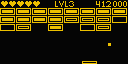

# ESPHome ClockOS

ESPHome ClockOS is my work in progress project for an ESPHome based desk clock with an OLED screen and rotary encoder.

## Games

### Breakout
This is my take on Breakout / Arkanoid. It's played by moving the paddle with the rotary encoder.

[Code](games/breakout.cpp)
