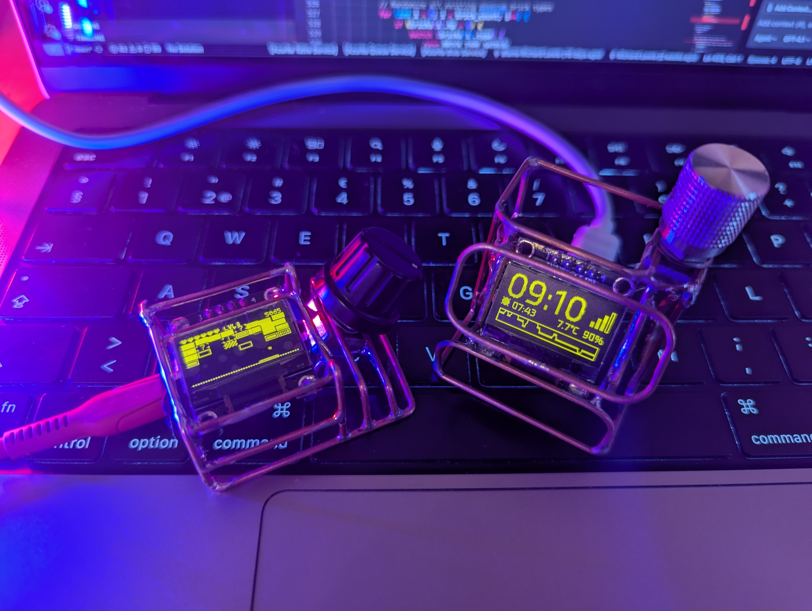

# ESPHome ClockOS

ESPHome ClockOS is my work in progress project for an ESPHome based desk clock with an OLED screen and rotary encoder. It is not only a clock and takes inspiration from 20000s era mobile phones.

## Hardware
I'm building my devices with a "freeform circuits" approach using 1.5mm copper wire for the frames and 1mm wire for the connections to the display, rotary encoder etc, but any other method works too as long as the minimum hardware requirements are met. So far I've had a good time with ESP32 C3 Super Mini boards due to their tiny form factor.

Here are the hardware components used, the required ones are marked with a checkmark.

- [X] ESP32 (I'm using C3 but any ESP32 should work)
- [X] Screen (128x64)
    - Tested SSD1306 and SSD1309
- [X] Rotary encoder
- [ ] Beeper
- [ ] Vibration motor
- [ ] Joystick
- [ ] A / B buttons

## Features
- Clock and alarm
- Games (Breakout and Snake)
- Demos (examples of what can be done with graphics)
- Floorplan (for controlling entities in the house)
- Settings
- Display timeout

## Software
ClockOS is built on the ESPHome platform.

## Menu system
The default screen is the Clock, and clicking the encoder opens the main menu, below is the menu hierarchy which outlines the current features of the project:

    [ Main Menu ]
    ├── Clock ⏵
    │   ├── Default clock
    │   ├── Analog clock
    │   ├── Alarm ⏵
    │   │   ├── Alarm [OFF]
    │   │   ├── Hour [9.0]
    │   │   └── Minute [30.0]
    ├── Games ⏵
    │   ├── Breakout ⏵
    │   │   ├── Play
    │   │   └── Autoplay [OFF]
    │   ├── Snake ⏵
    │   │   ├── Play
    │   │   ├── Speed [7.0]
    │   │   └── Walls [ON]
    │   └── Demos ⏵
    │       ├── DVD (bouncing DVD logo screensaver)
    │       ├── Spin (spinning ball animation)
    │       ├── Text Input (WIP)
    │       ├── Tokyo Bunny
    │       ├── Bunny Wiggle
    │       ├── Doodles
    │       ├── Joystick test
    │       └── Pixel paint
    ├── Sounds ⏵
    │   ├── Mario
    │   ├── Star Wars
    │   ├── Mission Impossible
    │   ├── Barbie Girl
    │   └── ...
    ├── Control ⏵
    │   ├── Turn off all lights
    │   └── Floorplan
    ├── Settings ⏵
    │   ├── Brightness [50.0]
    │   ├── Screen timeout [2.0]
    │   ├── Rumbole [ON]
    │   ├── Sound [ON]
    │   ├── Volume [2.0]
    │   └── System ⏵
    │       ├── Status
    │       ├── WiFi [ON]
    │       ├── Restart
    │       └── Factory reset
    └── Close

## Games

### Breakout

This is my take on Breakout / Arkanoid. It's played by moving the paddle with the rotary encoder. Features:

- Level progression: more bricks, power-ups and speed on each level
- Power-ups:
    - Extra life
    - Widen paddle
    - Wonky bricks: moves bricks around randomly
    - Multiball: spawn a new ball at the top of the screen above the paddle (max 10 balls simultaneously)
    - Shield which saves one ball from missing the paddle, can be stacked
    - Shooter: gives the paddle a shooter which shoots projectiles at the bricks damaging them, can be stacked once for a dual shooter
    - Question mark: shuffle all powerups randomly
- Autoplay: the game can play itself

[Code](clockos/packages/games/breakout/breakout.cpp)

### Snake
Simple Snake clone, features:
- Control snake direction by turning the head left & right with the rotary encoder
- 4 pickups available at all times
- Ability to change game speed
- Ability to enable/disable walls
    - When disabled the snake warps to the other side when crossing the screen edge

[Code](clockos/packages/games/snake/snake.cpp)

# TODO:
- [ ] Boot screen
- [ ] Add option to shows the clock after being idle for a while
- [X] Add display timeout setting
    - [ ] Does not work if a real time source isn't available / can't be synced
- [ ] Add rumble to alarm
- [ ] Make alarm tone selectable
- [ ] Add more clock faces and allow selecting the default
- [ ] Pausing a game when rumble is active causes the rumble to stay on, can probably fix by adding a timer which cuts it off after e.g. 2 seconds, or when leaving an app
- [ ] Make the system easily configurable for end users
- [ ] Stopwatch feature
- [ ] Rumble intensity setting (how long to rumble when triggered once)
    - This should help tune the intensity of rumble in games depending on the type of vibrator motor
- [ ] Game high scores
    - [ ] Requires adding a text input component
- [ ] Fix default clock showing full signal when not connected (show empty bars and X instead)
    - Similar info in System > Status screen
- [ ] Fix previous display page flashing when navigating to new page